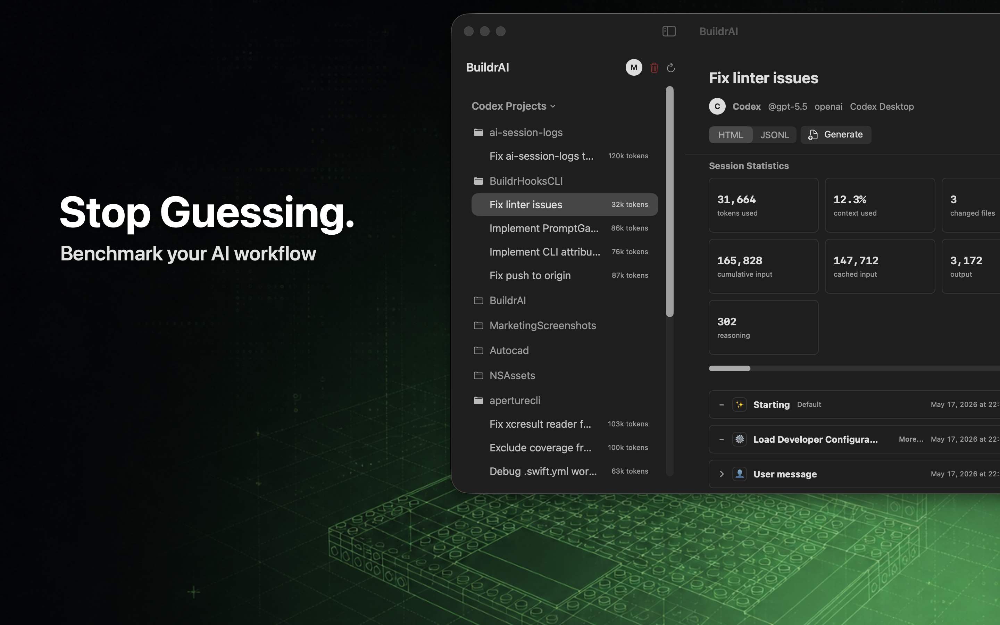

# BuildrAI

Stop guessing. Benchmark your AI workflow.

BuildrAI is a local-first macOS app for reviewing, evaluating, and sharing AI coding agent sessions. It turns local agent artifacts into a readable workspace for timelines, prompt quality, tool usage, token usage, context pressure, project activity, and share-ready reports.

## What BuildrAI Helps You Do

- Browse Codex and Claude Code sessions by project and recent activity
- Review readable transcript timelines instead of digging through raw files
- Find the message, tool call, file change, or session moment that matters
- Track token usage, context pressure, changed files, and prompt activity
- Improve prompt quality before repeating the same workflow
- Export clean reports and share-ready cards for completed sessions

## Why BuildrAI?

Raw transcripts can show what an agent emitted, but they rarely explain the work clearly. BuildrAI helps engineers understand what happened, what changed, which signals mattered, and what to do differently next time.

BuildrAI supports Codex and Claude Code today, with more agent tools coming soon.

## Local-First By Design

BuildrAI is designed around local-first session review. It reads local agent artifacts and repositories you authorize on your Mac, then helps you inspect sessions and export evidence without treating this repository as a place to upload private transcripts.

Before opening a public issue, redact private prompts, repository names, file paths, API keys, customer data, and any sensitive screenshots or snippets.

## Built For Engineers Using Agents Every Day

BuildrAI is for:

- Solo developers who want better feedback from agent-assisted work
- Teams reviewing the context behind AI-assisted changes
- Engineers improving prompt quality and workflow habits over time

## Resources

- Product page: https://buildrai.app/buildrai
- Marketing page: https://buildrai.app/buildrai/marketing
- Privacy policy: https://buildrai.app/buildrai/privacy
- Terms of use: https://buildrai.app/buildrai/terms

Availability and beta details live on the BuildrAI product pages.

## Feedback

Found a bug or have an idea?

- [Report a bug](https://github.com/michaelversus/BuildrAIApp/issues/new?template=bug_report.md)
- [Request a feature](https://github.com/michaelversus/BuildrAIApp/issues/new?template=feature_request.md)

Please keep public issues redacted and focused on reproducible product behavior.

## FAQ

### Is BuildrAI available to download?

Availability and beta details are published on the BuildrAI product pages.

### Which agent sources does BuildrAI support?

BuildrAI supports Codex and Claude Code today, with more agent tools coming soon.

### Does BuildrAI upload my session data?

BuildrAI is designed as a local-first macOS app. Review the privacy policy for the current data handling model.

### What should I include in a bug report?

Include the BuildrAI version/build, macOS version, Mac model or chip, affected source type, clear reproduction steps, expected behavior, actual behavior, and redacted screenshots or short redacted error snippets when useful.
